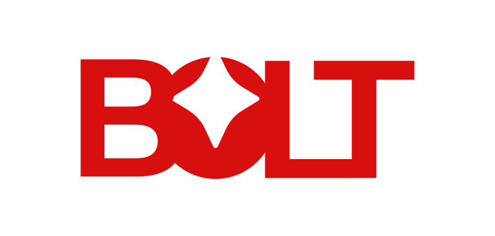
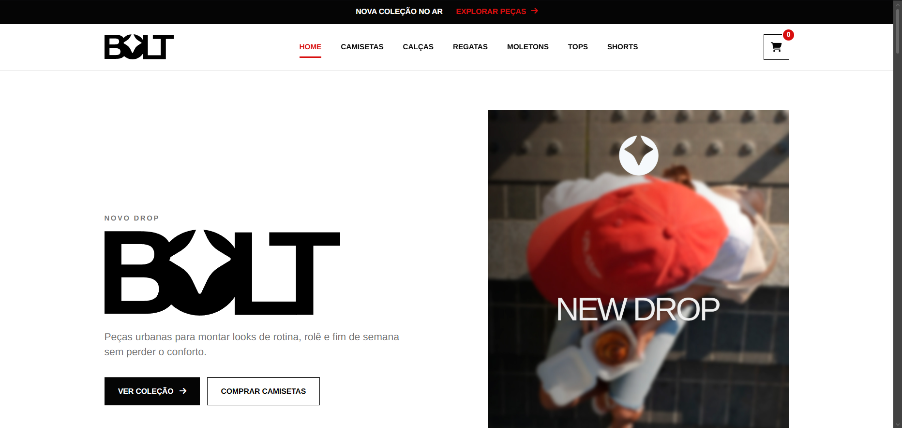
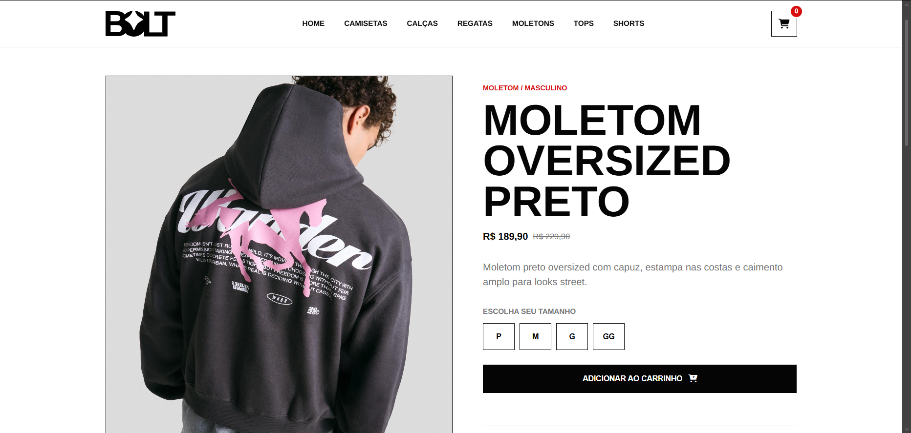
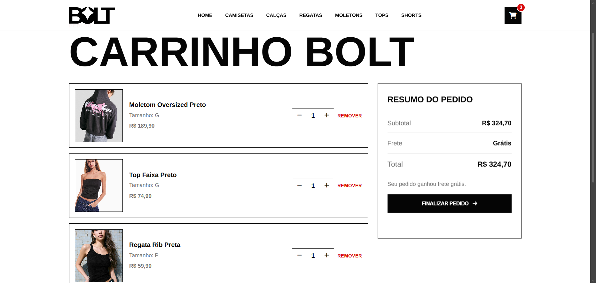
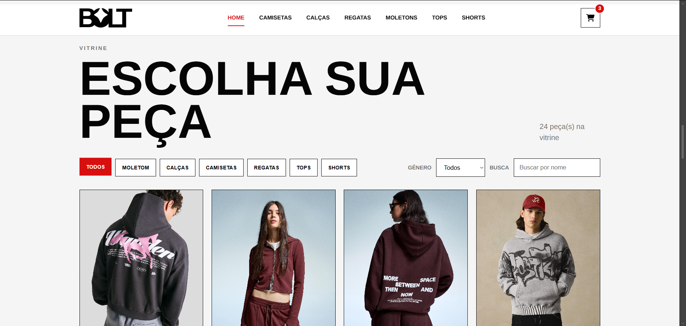
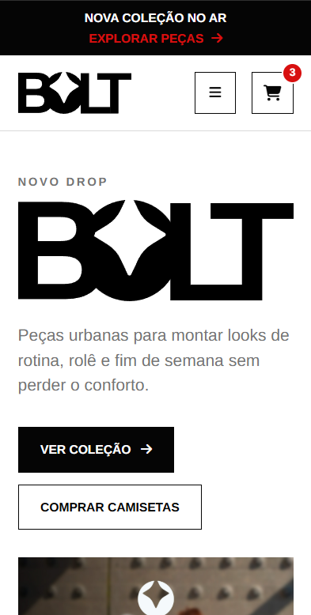

<!-- =========================================================
     BOLT STORE — README
     ========================================================= -->

<div align="center">



<br/><br/>

<!-- Título animado (renderiza mexendo no GitHub) -->


<p><strong>Loja virtual teen que consome uma API REST, com carrinho de compras funcional.</strong><br/>
Desafio técnico de estágio — front-end.</p>

<!-- Badges de tecnologias -->
<p>
  
  
  
  
  
</p>

<!-- Badges de status -->
<p>
  
  
  
  
</p>

<!-- Botão Ver Online (troque a URL depois de publicar) -->
<p>
  <a href="https://manuelalramos.github.io/bolt_store/">
    
  </a>
</p>

<!-- Atalhos de navegação -->
<p>
  <a href="#-sobre-o-desafio">Desafio</a> •
  <a href="#-demonstração">Demonstração</a> •
  <a href="#-funcionalidades">Funcionalidades</a> •
  <a href="#-tecnologias">Tecnologias</a> •
  <a href="#-como-rodar">Como rodar</a> •
  <a href="#-identidade-visual">Logo</a> •
  <a href="#-contato">Contato</a>
</p>

</div>

<br/>

<!-- ========================================================= -->

## 🎯 Sobre o desafio

Este projeto foi desenvolvido como **desafio técnico para uma vaga de estágio**. A proposta era construir uma aplicação de **loja virtual** em React ou JavaScript puro que **consumisse uma API REST**, simulada pelo arquivo `dbTeste.json` através do **JSON Server**.

Requisitos obrigatórios:

- **Listar os produtos** vindos da API;
- Permitir a **visualização individual** de cada produto;
- Ter um **carrinho de compras funcional** — adicionar/remover itens e ver um resumo antes de finalizar.

O enunciado também incentivava **incrementos** (filtros, paginação, etc.) e avaliava layout, funcionalidades, organização do código e boas práticas.

> Optei por **JavaScript puro**, sem frameworks, para demonstrar domínio dos fundamentos: manipulação do DOM, consumo de API com `fetch`, `async/await` e organização do código em módulos reutilizáveis.

<br/>

## 🖼️ Demonstração

<div align="center">

<!-- 📸 Tire os prints, salve em assets/media/prints/ com estes nomes -->


<br/><br/>

<table>
  <tr>
    <td width="50%"></td>
    <td width="50%"></td>
  </tr>
  <tr>
    <td align="center"><em>Página de produto</em></td>
    <td align="center"><em>Carrinho de compras</em></td>
  </tr>
</table>

<br/>

<table>
  <tr>
    <td width="50%"></td>
    <td width="50%"></td>
  </tr>
  <tr>
    <td align="center"><em>Página de categoria com filtros</em></td>
    <td align="center"><em>Layout responsivo (mobile)</em></td>
  </tr>
</table>

</div>

<br/>

## ✨ Funcionalidades

### Obrigatórias
- 🛍️ **Listagem de produtos** consumidos da API REST (JSON Server) — **24 produtos** cadastrados, cada um com **galeria de 3 fotos**.
- 🔎 **Visualização individual** de cada produto, aberta pela URL (`produto.html?id=`), com galeria de imagens, descrição, preços e seleção de tamanho.
- 🛒 **Carrinho de compras funcional**: adicionar, remover, alterar quantidade e ver o **resumo** (subtotal, frete e total) antes de finalizar.

### Incrementos que adicionei
- 🧭 **Filtros combinados** na home: por **categoria**, por **gênero** (feminino/masculino) e **busca por nome** em tempo real.
- 🗂️ **Páginas por categoria** — camisetas, calças, regatas, moletons, tops e shorts — cada uma com filtro de gênero próprio.
- 🖼️ **Galeria de imagens** por produto, com troca de foto na página de detalhe.
- 🔗 **Produtos relacionados** na tela de detalhe.
- 💾 **Carrinho persistente** via `localStorage` (sobrevive ao recarregar a página).
- 🚚 **Frete grátis** automático acima de R$ 300.
- 🔁 **Fallback inteligente**: se a API do JSON Server estiver fora do ar, a aplicação carrega automaticamente o `dbTeste.json` local — a loja nunca fica vazia (inclusive quando publicada online).
- 📱 **Layout responsivo** (desktop, tablet e mobile) com menu adaptável.
- 🎬 **Animações de entrada** ao rolar a página (`IntersectionObserver`) e validação de e-mail na newsletter.

<br/>

## 🛠️ Tecnologias

| Tecnologia | Para quê |
|---|---|
| **HTML5 semântico** | Estrutura das páginas |
| **CSS3** | Estilização, layout com Grid/Flexbox e responsividade |
| **JavaScript (ES6+)** | Lógica, consumo de API, `async/await`, manipulação do DOM |
| **JSON Server** | API REST fake a partir do `dbTeste.json` |
| **Vite** | Servidor de desenvolvimento local |
| **Concurrently** | Roda o site e a API ao mesmo tempo |
| **Font Awesome** | Ícones |

<br/>

## 🗂️ Estrutura do projeto

```
bolt_estagio_tgid/
├── index.html                # Home (vitrine + filtros + busca)
├── dbTeste.json              # Base de dados servida pela API
├── pages/                    # Páginas internas
│   ├── produto.html          # Detalhe do produto (galeria + tamanhos)
│   ├── carrinho.html         # Carrinho de compras
│   ├── camisetas.html        # Páginas por categoria
│   ├── calcas.html
│   ├── regatas.html
│   ├── moletons.html
│   ├── tops.html
│   └── shorts.html
├── assets/
│   ├── css/                  # main.css importa as demais folhas
│   ├── js/
│   │   ├── utilidades.js     # Núcleo: API, carrinho, cards
│   │   ├── produtos.js       # Lógica da home (listagem + filtros)
│   │   ├── produto.js        # Lógica do detalhe + galeria
│   │   ├── categoria.js      # Lógica das páginas de categoria
│   │   ├── carrinho.js       # Lógica do carrinho
│   │   └── menu.js           # Interações globais (menu, newsletter, animações)
│   └── media/
│       ├── logo_bolt_vermelha.svg
│       ├── logo_bolt_branca.svg
│       └── produtos/         # Fotos dos produtos
├── package.json
└── README.md
```

<br/>

## ⚙️ Como rodar

Pré-requisito: **Node.js** instalado.

```bash
# 1. Clone o repositório
git clone https://github.com/manuelalramos/bolt_estagio_tgid.git

# 2. Entre na pasta
cd bolt_estagio_tgid

# 3. Instale as dependências
npm install

# 4. Rode o site + a API ao mesmo tempo
npm run dev
```

Depois acesse:

| Recurso | Endereço |
|---|---|
| 🖥️ Site | `http://127.0.0.1:5500` |
| 🔌 API (JSON Server) | `http://localhost:3000/produtos` |

> 💡 A aplicação tenta consumir a API primeiro; se ela não estiver rodando, usa automaticamente os dados de `dbTeste.json`.

<br/>

## 🎨 Identidade visual

<div align="center">
  
</div>

A **logo da Bolt Store foi criada por mim**, do conceito ao vetor final. O raio (⚡) representa a energia e a atitude do público teen, e a tipografia forte reforça a pegada streetwear da marca. As versões em vermelho e branco garantem contraste em fundos claros e escuros.

Arquivos disponíveis:

- 📥 **[Baixar arquivo editável do Illustrator (`.ai`)](./assets/media/bolt.ai)**


<br/>

## 📬 Contato

Fico à disposição para conversar sobre o projeto ou a vaga!

<div align="center">

<a href="mailto:contato@manuelalramos.com.br">
  
</a>
<a href="https://linkedin.com/in/manuelalramos">
  
</a>
<a href="https://manuelalramos.com.br">
  
</a>

</div>

<br/>

<div align="center">
  <sub>Desenvolvido com ⚡ por <strong>Manuela Ramos</strong> — logo, código e layout autorais.</sub>
</div